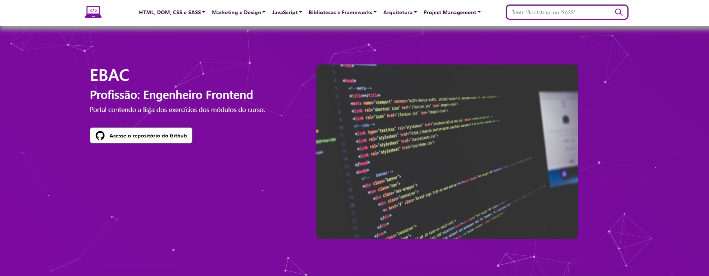

<div align="center">

</div>

<h1 align="center">EBAC - Profissão: Engenheiro Frontend</h1>
<p align=center><i align="center">Repositório contendo o conteúdo relevante das aulas do curso "Profissão: Engenheiro Front-End" da Instituição EBAC - Escola Britânica de Artes Criativas e Tecnologia</i></p>

<br>

<div align="center">

<a href="https://www.w3.org/Style/CSS/Overview.en.html"></a>&nbsp;
<a href="https://html.com"></a>&nbsp;
<a href="https://sass-lang.com"></a>&nbsp;
<a href="https://jquery.com"></a>&nbsp;
<a href="https://getbootstrap.com"></a>
<br>
<a href="https://nodejs.org/en/"></a>&nbsp;
<a href="https://reactjs.org"></a>&nbsp;
<a href="https://babeljs.io"></a>&nbsp;
<a href="https://gulpjs.com"></a>&nbsp;
<a href="https://webpack.js.org"></a>
<br>
<a href="https://vuejs.org/guide/introduction.html"></a>&nbsp;
<a href="https://mui.com/material-ui/getting-started/"></a>&nbsp;
<a href="https://www.javascript.com"></a>&nbsp;
<a href="https://www.netlify.com"></a>
<br>
<a href="https://.chromatic.com"></a>&nbsp;
<a href="https://storybook.js.org"></a>
<br>
<a href=""></a>&nbsp;
<a href=""></a>&nbsp;
<a href=""></a>
<br>
<a href=""></a>&nbsp;
<a href=""></a>&nbsp;
<a href="https://github.com/dexdevlab/ebac-engenheiro-frontend/blob/main/LICENSE"></a>

</div>

## Conteúdo

<br>

Este repositório armazena todo o conteúdo relevante estudado no curso 'Engenheiro Frontend', e contém uma página inicial para acesso fácil aos diversos conteúdos dos exercícios dos módulos do curso.

## Funcionamento da Aplicação

Esta aplicação é um SPA baseado em Bootstrap e JQuery, com um funcionamento extremamente simples:

- A página principal é [`index.html`](https://github.com/DexDevLab/ebac-engenheiro-frontend/tree/main/index.html), localizada na raiz do repositório
- Os exercícios e demais materiais relacionados ao curso se encontram no diretório [`src/conteudo`](https://github.com/DexDevLab/ebac-engenheiro-frontend/tree/main/src/conteudo)
- Em [`src/components/banners.js`](https://github.com/DexDevLab/ebac-engenheiro-frontend/blob/main/src/components/banners.js) é possível adicionar, remover e modificar o conteúdo exibido nos banners da página principal

Uma implementação no Github Pages pode ser testada <a href="https://dexdevlab.github.io/ebac-engenheiro-frontend/" target="_blank">`aqui`</a>.

## Instruções

<br>

### Utilizando o repositório como projeto

Faça um git clone ou o download do repositório, da forma que preferir

```bash
git clone https://github.com/dexdevlab/ebac-engenheiro-frontend.git
```

### Testando a aplicação

Abra o arquivo `index.html` usando seu navegador ou, preferencialmente, utilize uma extensão de visualizador de html com web server, como o [Live Preview](https://marketplace.visualstudio.com/items?itemName=ms-vscode.live-server)

### Implementação no Github Pages

Para implementar o projeto no Github Pages, basta realizar commit do seu projeto usando versionamento padrão no arquivo [`package.json`](https://github.com/DexDevLab/ebac-engenheiro-frontend/tree/main/package.json)`. Alternativamente, você pode realizar a configuração padrão do [GitHub Pages](https://docs.github.com/en/pages/getting-started-with-github-pages/configuring-a-publishing-source-for-your-github-pages-site) em seu repositório.

### Configurando o GitHub Actions

Este repositório contém 2 scripts do GitHub Actions. Para que ambos funcionem corretamente, é necessário realizar os seguintes ajustes no repositório:

Vá nas Configurações Gerais de Ações do repositório (`<https://github.com/><NOME_DO_USUARIO>/<NOME_DO_REPOSITORIO>/settings/actions`)

1 - Marque 'Allow all actions and reusable workflows' em 'Actions permissions'

2 - Marque 'Read and write permissions' em 'Workflow permissions'

## Notas de versão

<br>

### v3.15.1-250608

- Elaboração parcial do exercício do Módulo 15 (React do Zero ao Pro)

### v3.15.0-240508

- Atualização do README
- Atualização da documentação
- Testes de implementação do GitHub Actions
- Elaboração parcial do exercício do Módulo 15 (React do Zero ao Pro)

### v3.14.0-240427

- Conteúdo do exercício do Módulo 14 (React do Zero ao Pro)
- Atualização do README

### v3.13.0-240411

- Conteúdo do exercício do Módulo 13 (React do Zero ao Pro)

### v3.12.0-240409

- Conteúdo do exercício do Módulo 12 (React do Zero ao Pro)

### v3.11.1-240408

- Alteração do link de exibição do exercício do Módulo 11 (React do Zero ao Pro)

### v3.11.0-240408

- Conteúdo do exercício do Módulo 11 (React do Zero ao Pro)

### v3.10.0-240403

- Conteúdo do exercício do Módulo 10 (React do Zero ao Pro)

### v3.9.0-240323

- Alteração no componente de formulário e máscara do exercício do Módulo 07 (React do Zero ao Pro)
- Melhora do algoritmo e métodos de validação do formulário do exercício do Módulo 07 (React do Zero ao Pro)
- Conteúdo do exercício do Módulo 09 (React do Zero ao Pro)

### v3.8.0-240315

- Alteração no componente de formulário e máscara do exercício do Módulo 07 (React do Zero ao Pro)
- Melhora do algoritmo e métodos de validação do formulário do exercício do Módulo 07 (React do Zero ao Pro)
- Conteúdo do exercício do Módulo 08 (React do Zero ao Pro)

### v3.7.0-240305

- Adicionado script de limpeza do Yarn para o repositório
- Adicionado script de limpeza do cache do git
- Atualização do gitignore
- Corrigida referência do link para a atividade do exercício do Módulo 06 (React do Zero ao Pro)
- Conteúdo do exercício do Módulo 07 (React do Zero ao Pro)
- Removida integração com o Snyk para o repositório
- Ajuste de sintaxe e linting do workflow do Github Actions

### v3.6.0-230511

- Corrigida referência do módulo dentro das informações do projeto em package.json para o Módulo 05 (React do Zero ao Pro)
- Conteúdo do exercício do Módulo 06 (React do Zero ao Pro)

### v3.5.0-230510

- Conteúdo do exercício do Módulo 05 (React do Zero ao Pro)
- Melhoria no algoritmo da barra de busca com inclusão de palavras-chave

### v3.4.0-230504

- Conteúdo do exercício do Módulo 04 (React do Zero ao Pro)

### v3.3.0-230502

- Conteúdo do exercício do Módulo 03 (React do Zero ao Pro)

### v3.2.0-230429

- Conteúdo do exercício do Módulo 02 (React do Zero ao Pro)
- Ajuste no exercício do Módulo 02 para exibição do Alert

### v3.1.0-230427

- Conteúdo do exercício do Módulo 01 (React do Zero ao Pro)
- Atualização do sitemap

### v3.0.0-230427

- Alteração do termo "master" para "main" nas terminologias em todo o projeto

### v2.16.0-230425

- Conteúdo do exercício do Módulo 48
- Ajuste no algoritmo de busca
- Leve alteração nos estilos e labels da barra de busca

### v2.15.0-230424

- Conteúdo do exercício do Módulo 47
- Ajustes na exibição de estilos e localização do CSS bootstrap do Módulo 40

### v2.14.0-230423

- Conteúdo do exercício do Módulo 46

### v2.13.1-230422

- Ajuste na imagem do banner da Seção React - Introdução

### v2.13.0-230422

- Conteúdo do exercício do Módulo 44
- Conteúdo do exercício do Módulo 45

### v2.12.0-230420

- Conteúdo do exercício do Módulo 43

### v2.11.0-230420

- Conteúdo do exercício do Módulo 42

### v2.10.1-230419

- Ajuste no botão do exercício do Módulo 41 para o download correto do arquivo

### v2.10.0-230419

- Conteúdo do exercício do Módulo 41

### v2.9.0-230419

- Conteúdo do exercício do Módulo 40

### v2.8.0-230413

- Conteúdo do exercício do Módulo 39

### v2.7.0-230412

- Atualização da Documentação
- Atualização da versão das bibliotecas SASS dos projetos conforme recomendação de segurança
- Conteúdo do exercício do Módulo 38
- Conteúdo do exercício do Módulo 37

### v2.6.0-230329

- Atualização da Documentação
- Conteúdo do exercício do Módulo 35

### v2.5.0-230327

- Ajustes no exercício do Módulo 31
- Conteúdo do exercício do Módulo 32

### v2.4.2-230327

- Ajustes visuais e de performance nos resultados das requisições de API do exercício do Módulo 31

### v2.4.1-230325

- Atualização da Documentação

### v2.4.0-230325

- Conteúdo do exercício do Módulo 31

### v2.3.1-230319

- Elaboração parcial do exercício do Módulo 31

### v2.3.0-230316

- Conteúdo do exercício do Módulo 30
- Ajuste de layout do Portal de Exercícios

### v2.2.0-230315

- Alteração da estrutura de pastas do Módulo 28
- Conteúdo do exercício do Módulo 29

### v2.1.0-230313

- Conteúdo do exercício do Módulo 28

### v2.0.1-230312

- Atualização de gulp-image para melhoria de segurança

### v2.0.0-230312

- Ajuste de responsividade no conteúdo do Módulo 26
- Atualização do JQueryUI para melhoria de segurança
- Conteúdo do exercício do Módulo 27
- Alteração da estrutura de pastas e disposição dos módulos
- Alteração do layout do Portal de Exercícios
- Correção de CSS e disposição de layout de exercícios de módulos anteriores

### v1.9.1-230310

- Atualização da documentação

### v1.9.0-230310

- Atualização da documentação
- Criação de workflow para geração automática de tag e release
- Conteúdo do exercício do Módulo 26

### v1.8.0-230304

- Ajustes de layout das imagens de banner para alguns viewports
- Conteúdo do exercício do Módulo 25

### v1.7.0-230302

- Ajustes de layout da disposição de botões e tamanho de banner para alguns viewports
- Conteúdo do exercício do Módulo 24

### v1.6.0-230301

- Conteúdo do exercício do Módulo 23 (Parte 2)

### v1.5.0-230301

- Conteúdo do exercício do Módulo 23
- Ajuste na animação do erro da página de erro (404.html) em todos os locais em que ela é utilizada

### v1.4.1-230227

- Início da elaboração do exercício do Módulo 23

### v1.4.0-230217

- Conteúdo do exercício do Módulo 22
- Componentização da Navbar para composição dinâmica do elemento

### v1.3.0-230216

- Conteúdo do exercício do Módulo 21

### v1.2.0-230215

- Conteúdo do exercício do Módulo 20

### v1.1.1-230214

- Ajuste em links quebrados na Navbar
- Ajuste nas imagens que não carregavam nos banners de seção

### v1.1.0-230131

- Atualização do README
- Conteúdo do exercício do Módulo 19
- Atualização do Portal de Exercícios

### v1.0.0-230129

- Atualização do README
- Remoção dos arquivos de personalização do VSCode
- Correção de bugs no exercício do Módulo 17
- Conteúdo do exercício do Módulo 18
- Alteração da estrutura de pastas do Módulo de JavaScript
- Alteração do Layout do Portal de Exercícios
- Atribuição de Licença ao repositório
- Criação de Arquivo JSCONFIG para linting e autocompletar de JQuery

### v0.0.18-230124

- Atualização do README
- Ajuste no algoritmo do script do exercício do Módulo 15 para correto funcionamento das validações dos campos;
- Ajuste no HTML do exercício do Módulo 15
- Ajuste nos botões do Portal de Exercícios
- Ajuste no comportamento da navbar mobile do Portal de Exercícios
- Restruturação de alguns links quebrados no Portal de Exercícios
- Restruturação de pastas do repositório
- Conteúdo do exercício do Módulo 17

### v0.0.17-230118

- Atualização do README
- Ajuste no algoritmo do script do exercício do Módulo 15 para correto funcionamento das validações dos campos;
- Ajuste no HTML do exercício do Módulo 15
- Ajuste nos botões do Portal de Exercícios

### v0.0.16-230118

- Atualização do README
- Alteração no alinhamento de containers no portal de exercícios
- Ajuste nas referências de link e CSS de páginas de exercícios
- Ajuste nos componentes HTML de certas páginas de exercícios
- Ajuste de links quebrados no portal de exercícios

### v0.0.15-230118

- Atualização do README
- Alteração da estrutura de pastas
- Revisão dos hiperlinks para funcionamento dentro do Github Pages

### v0.0.14-230118

- Atualização do README
- Alteração da estrutura de pastas
- Criação de diretório para publicação de site no Github Pages contendo os exercícios dos módulos
- Conteúdo do exercício do Módulo 16

### v0.0.13-230112

- Alteração na estrutura de pastas do repositório
- Atualização do README
- Inclusão do Exerício do Módulo 15

### v0.0.12-230110

- Atualização do README
- Remoção do CHANGELOG e inclusão dos dados de volta no README
- Remoção dos Branches e unificação do conteúdo em um único branch principal. A criação dos
branches poderá se refeita em caso de necessidade

### v0.0.11-220830

- Atualização do README
- Atualização do CHANGELOG

### v0.0.10-220830

- Alteração do encurtador para bitly para melhor compatibilidade

### v0.0.9-220830

- Remoção do CHANGELOG do branch docs e exclusão do mesmo
- Atualização do CHANGELOG no branch main
- Atualização do README

### v0.0.8-220830

- Alteração da newsletter para conter os links redirecionados do encurtador e validar juntamente com o github io.

### v0.0.7-220830

- Criação do branch landing-page contendo o material do exercício de landing page do Módulo 12

### v0.0.6-220830

- Criação do branch inbound-marketing contendo o material das aulas sobre Inbound Marketing Flow

### v0.0.5-220830

- Criação do branch html-css contendo o material das aulas dos módulos 3 ao 9

### v0.0.4-220830

- Criação do branch docs contendo CHANGELOG e demais arquivos de documentação comuns do projeto

### v0.0.3-220830

- Remoção do conteúdo das aulas dos módulos 3 ao 9 para um branch separado;
- Atualização do README para apontar para um único CHANGELOG;

### v0.0.2-220829

- Restruturação do repositório separando em aulas de HTML/CSS e os projetos separados de acordo com o que é requisitado no módulo
- Entrega do exercício do Módulo 11 ("Pronto Cloud"): inclusão de imagens base do repositório do professor, além de imagens escolhidas individualmente; criação do CSS de acordo e refatoração do HTML de base
- Correção do layout do CHANGELOG

### v0.0.1-220828

- Criação do repositório
- Remoção dos arquivos zipados conforme solicitado
- Criação da documentação (README e CHANGELOG)

## Contato

<br>

Se você gostou desse projeto, nos dê uma <a href="https://github.com/dexdevlab/ebac-engenheiro-frontend" data-icon="octicon-star" aria-label="Star dexdevlab/ebac-engenheiro-frontend on GitHub">estrela</a>. <br>
Para contato, envie um email a: <a href="mailto:dex.houshi@hotmail.com">dex.houshi@hotmail.com</a>

## Licença

<br>

Licenciado sob a [MIT License](https://github.com/dexdevlab/ebac-engenheiro-frontend/blob/main/LICENSE).
