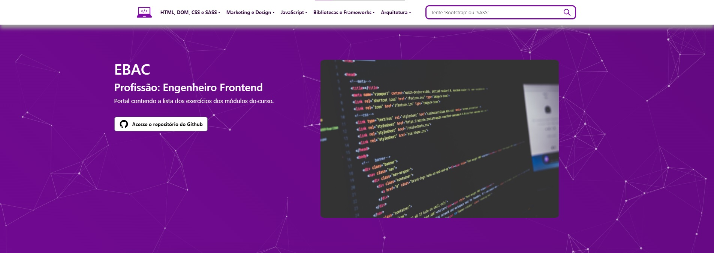

<h1 align="center">EBAC - Profissão: Engenheiro Frontend</h1>

<i align="center">Repositório contendo o conteúdo relevante das aulas do curso "Profissão: Engenheiro Front-End" da Instituição EBAC - Escola Britânica de Artes Criativas e Tecnologia</i>

 

<a href="https://html.com">

|| [Conteúdo](#section-conteudo) || [Stack](#section-stack) || [Notas de versão](#section-changelog) || [Autores](#section-autores) ||

|| [Contato](#section-contato) || [Licença](#section-licenca) || [Portal de Exercícios](https://dexdevlab.github.io/ebac-engenheiro-frontend) ||

<a name="section-conteudo">

## Conteúdo

</a>

 

Este repositório armazena todo o conteúdo relevante estudado no curso 'Engenheiro Frontend', e contém uma página inicial para acesso fácil aos diversos conteúdos dos exercícios dos módulos do curso.

<a name="section-stack">

## Stack

</a>

- **Framework de Aplicação:** [Node.js](https://nodejs.org/en/)
- **Linguagem Principal:** [Javascript](https://developer.mozilla.org/pt-BR/docs/Web/JavaScript)
- **Linguagem de Marcação:** [HTML](https://developer.mozilla.org/pt-BR/docs/Web/HTML)
- **Linguagem de Estilização:** [CSS](https://developer.mozilla.org/pt-BR/docs/Web/CSS), [SASS](https://sass-lang.com)
- **Framework de Design:** [Bootstrap](https://getbootstrap.com)
- **Bibliotecas de Compilação:** [Gulp](https://gulpjs.com), [Babel](https://babeljs.io), [Webpack](https://webpack.js.org)

<a name="section-changelog">

## Notas de versão

</a>

 

### v2.11.0-230420

- Conteúdo do exercício do Módulo 42

### v2.10.1-230419

- Ajuste no botão do exercício do Módulo 41 para o download correto do arquivo

### v2.10.0-230419

- Conteúdo do exercício do Módulo 41

### v2.9.0-230419

- Conteúdo do exercício do Módulo 40

### v2.8.0-230413

- Conteúdo do exercício do Módulo 39

### v2.7.0-230412

- Atualização da Documentação
- Atualização da versão das bibliotecas SASS dos projetos conforme recomendação de segurança
- Conteúdo do exercício do Módulo 38
- Conteúdo do exercício do Módulo 37

### v2.6.0-230329

- Atualização da Documentação
- Conteúdo do exercício do Módulo 35

### v2.5.0-230327

- Ajustes no exercício do Módulo 31
- Conteúdo do exercício do Módulo 32

### v2.4.2-230327

- Ajustes visuais e de performance nos resultados das requisições de API do exercício do Módulo 31

### v2.4.1-230325

- Atualização da Documentação

### v2.4.0-230325

- Conteúdo do exercício do Módulo 31

### v2.3.1-230319

- Elaboração parcial do exercício do Módulo 31

### v2.3.0-230316

- Conteúdo do exercício do Módulo 30
- Ajuste de layout do Portal de Exercícios

### v2.2.0-230315

- Alteração da estrutura de pastas do Módulo 28
- Conteúdo do exercício do Módulo 29

### v2.1.0-230313

- Conteúdo do exercício do Módulo 28

### v2.0.1-230312

- Atualização de gulp-image para melhoria de segurança

### v2.0.0-230312

- Ajuste de responsividade no conteúdo do Módulo 26
- Atualização do JQueryUI para melhoria de segurança
- Conteúdo do exercício do Módulo 27
- Alteração da estrutura de pastas e disposição dos módulos
- Alteração do layout do Portal de Exercícios
- Correção de CSS e disposição de layout de exercícios de módulos anteriores

### v1.9.1-230310

- Atualização da documentação

### v1.9.0-230310

- Atualização da documentação
- Criação de workflow para geração automática de tag e release
- Conteúdo do exercício do Módulo 26

### v1.8.0-230304

- Ajustes de layout das imagens de banner para alguns viewports
- Conteúdo do exercício do Módulo 25

### v1.7.0-230302

- Ajustes de layout da disposição de botões e tamanho de banner para alguns viewports
- Conteúdo do exercício do Módulo 24

### v1.6.0-230301

- Conteúdo do exercício do Módulo 23 (Parte 2)

### v1.5.0-230301

- Conteúdo do exercício do Módulo 23
- Ajuste na animação do erro da página de erro (404.html) em todos os locais em que ela é utilizada

### v1.4.1-230227

- Início da elaboração do exercício do Módulo 23

### v1.4.0-230217

- Conteúdo do exercício do Módulo 22
- Componentização da Navbar para composição dinâmica do elemento

### v1.3.0-230216

- Conteúdo do exercício do Módulo 21

### v1.2.0-230215

- Conteúdo do exercício do Módulo 20

### v1.1.1-230214

- Ajuste em links quebrados na Navbar
- Ajuste nas imagens que não carregavam nos banners de seção

### v1.1.0-230131

- Atualização do README
- Conteúdo do exercício do Módulo 19
- Atualização do Portal de Exercícios

### v1.0.0-230129

- Atualização do README
- Remoção dos arquivos de personalização do VSCode
- Correção de bugs no exercício do Módulo 17
- Conteúdo do exercício do Módulo 18
- Alteração da estrutura de pastas do Módulo de JavaScript
- Alteração do Layout do Portal de Exercícios
- Atribuição de Licença ao repositório
- Criação de Arquivo JSCONFIG para linting e autocompletar de JQuery

### v0.0.18-230124

- Atualização do README
- Ajuste no algoritmo do script do exercício do Módulo 15 para correto funcionamento das validações dos campos;
- Ajuste no HTML do exercício do Módulo 15
- Ajuste nos botões do Portal de Exercícios
- Ajuste no comportamento da navbar mobile do Portal de Exercícios
- Restruturação de alguns links quebrados no Portal de Exercícios
- Restruturação de pastas do repositório
- Conteúdo do exercício do Módulo 17

### v0.0.17-230118

- Atualização do README
- Ajuste no algoritmo do script do exercício do Módulo 15 para correto funcionamento das validações dos campos;
- Ajuste no HTML do exercício do Módulo 15
- Ajuste nos botões do Portal de Exercícios

### v0.0.16-230118

- Atualização do README
- Alteração no alinhamento de containers no portal de exercícios
- Ajuste nas referências de link e CSS de páginas de exercícios
- Ajuste nos componentes HTML de certas páginas de exercícios
- Ajuste de links quebrados no portal de exercícios

### v0.0.15-230118

- Atualização do README
- Alteração da estrutura de pastas
- Revisão dos hiperlinks para funcionamento dentro do Github Pages

### v0.0.14-230118

- Atualização do README
- Alteração da estrutura de pastas
- Criação de diretório para publicação de site no Github Pages contendo os exercícios dos módulos
- Conteúdo do exercício do Módulo 16

### v0.0.13-230112

- Alteração na estrutura de pastas do repositório
- Atualização do README
- Inclusão do Exerício do Módulo 15

### v0.0.12-230110

- Atualização do README
- Remoção do CHANGELOG e inclusão dos dados de volta no README
- Remoção dos Branches e unificação do conteúdo em um único branch principal. A criação dos
branches poderá se refeita em caso de necessidade

### v0.0.11-220830

- Atualização do README
- Atualização do CHANGELOG

### v0.0.10-220830

- Alteração do encurtador para bitly para melhor compatibilidade

### v0.0.9-220830

- Remoção do CHANGELOG do branch docs e exclusão do mesmo
- Atualização do CHANGELOG no branch master
- Atualização do README

### v0.0.8-220830

- Alteração da newsletter para conter os links redirecionados do encurtador e validar juntamente com o github io.

### v0.0.7-220830

- Criação do branch landing-page contendo o material do exercício de landing page do Módulo 12

### v0.0.6-220830

- Criação do branch inbound-marketing contendo o material das aulas sobre Inbound Marketing Flow

### v0.0.5-220830

- Criação do branch html-css contendo o material das aulas dos módulos 3 ao 9

### v0.0.4-220830

- Criação do branch docs contendo CHANGELOG e demais arquivos de documentação comuns do projeto

### v0.0.3-220830

- Remoção do conteúdo das aulas dos módulos 3 ao 9 para um branch separado;
- Atualização do README para apontar para um único CHANGELOG;

### v0.0.2-220829

- Restruturação do repositório separando em aulas de HTML/CSS e os projetos separados de acordo com o que é requisitado no módulo
- Entrega do exercício do Módulo 11 ("Pronto Cloud"): inclusão de imagens base do repositório do professor, além de imagens escolhidas individualmente; criação do CSS de acordo e refatoração do HTML de base
- Correção do layout do CHANGELOG

### v0.0.1-220828

- Criação do repositório
- Remoção dos arquivos zipados conforme solicitado
- Criação da documentação (README e CHANGELOG)

<a name="section-autores">

## Autores

</a>

<a name="section-contato">

## Contato

</a>

Se você gostou desse projeto, nos dê uma <a href="https://github.com/dexdevlab/ebac-engenheiro-frontend" data-icon="octicon-star" aria-label="Star dexdevlab/ebac-engenheiro-frontend on GitHub">estrela</a>.  
Para contato, envie um email a: <a href="mailto:dex.houshi@hotmail.com">dex.houshi@hotmail.com</a>

<a name="section-licenca">

## Licença

</a>

Licenciado sob a [MIT License](https://github.com/dexdevlab/ebac-engenheiro-frontend/blob/master/LICENSE).
